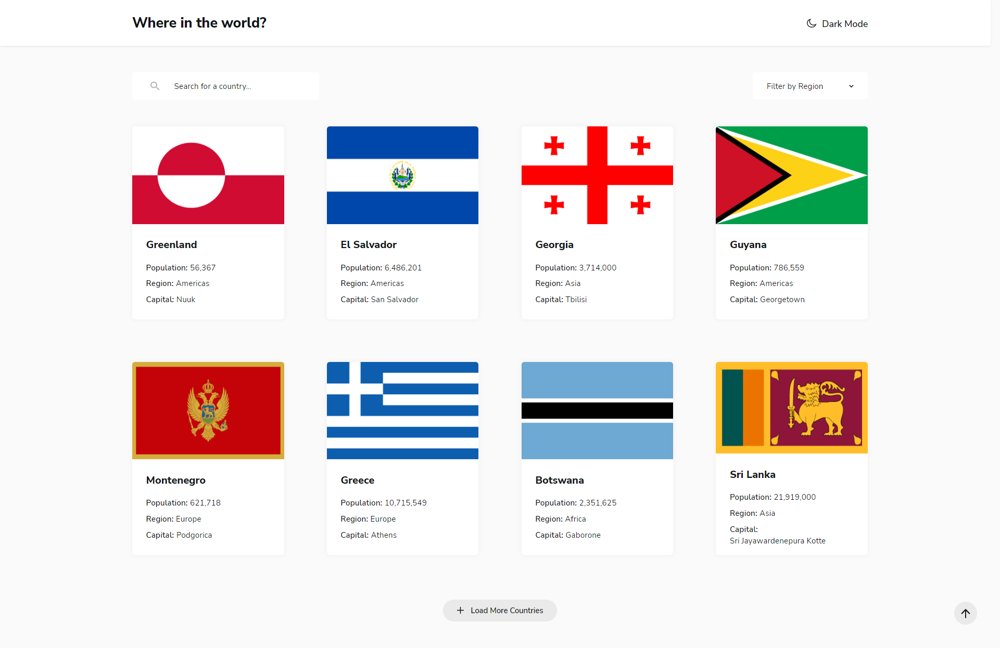
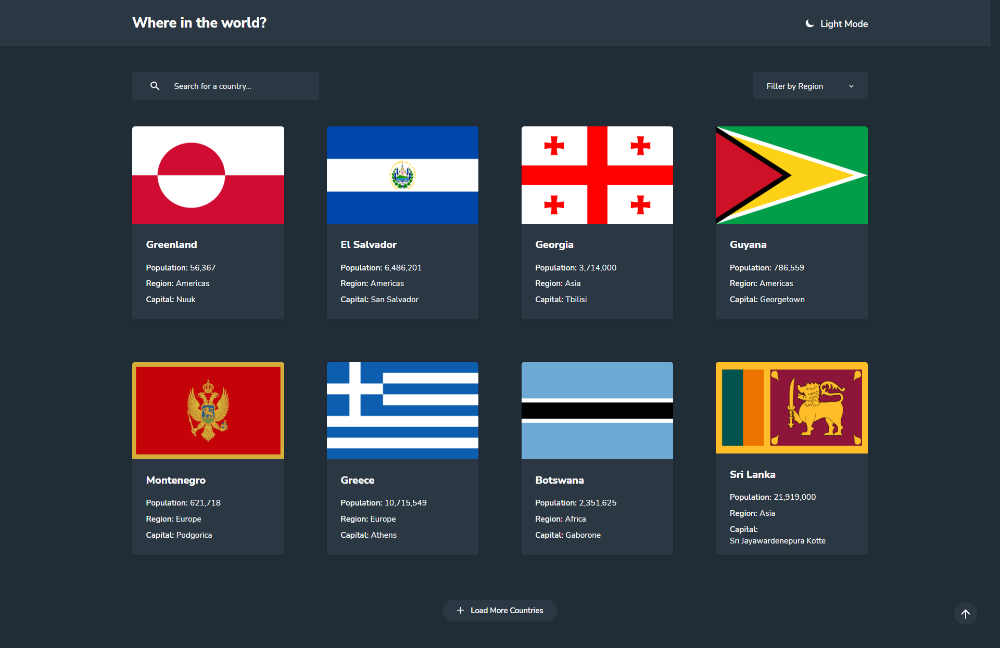
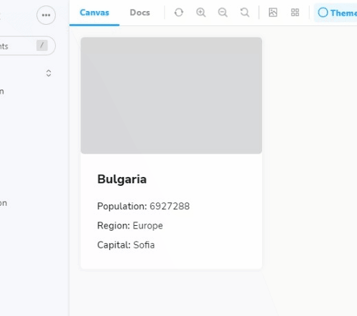
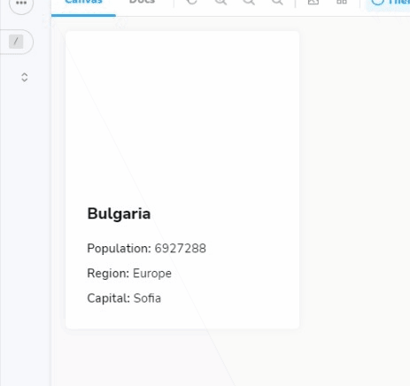

# Frontend Mentor - REST Countries API with color theme switcher solution

This is a solution to the [REST Countries API with color theme switcher challenge on Frontend Mentor](https://www.frontendmentor.io/challenges/rest-countries-api-with-color-theme-switcher-5cacc469fec04111f7b848ca). Frontend Mentor challenges help you improve your coding skills by building realistic projects. 

## Table of contents

- [Overview](#overview)
  - [The challenge](#the-challenge)
  - [Screenshot](#screenshot)
  - [Links](#links)
- [My process](#my-process)
  - [Built with](#built-with)
  - [What I learned](#what-i-learned)
  - [Useful resources](#useful-resources)
- [Author](#author)

## Overview

### The challenge

Users should be able to:

- See all countries from the API on the homepage
- Search for a country using an `input` field
- Filter countries by region
- Toggle the color scheme between light and dark mode 

### Screenshot

### Links

- Live Site URL: [Where in the world?](https://rest-coutries-api.web.app/)

## My process

### Built with

- Semantic HTML5 markup
- CSS custom properties
- Flexbox
- CSS Grid
- Mobile-first workflow
- [React](https://reactjs.org/) - JS library
- [React Query](https://tanstack.com/query/v4/?from=reactQueryV3&original=https://react-query-v3.tanstack.com/) - Caching
- [Axios](https://axios-http.com/ptbr/docs/intro) - HTTP Client
- [Storybook](https://storybook.js.org/) - For build components
- [Styled Components](https://styled-components.com/) - For styles

### What I learned

- Make AJAX requests
- Manage client-side caching
- Build filter and search components
- Control pagination of large amount of data
- Build components with Storybook
- Use Context API to manage global states

### Useful resources

- [Storybook Code Evolution Tutorial](https://www.youtube.com/playlist?list=PLC3y8-rFHvwhC-j3x3t9la8-GQJGViDQk) - Helped me understand the steps of building isolated components. I really liked Storybook and will use it going forward.
- [React Query Code Evolution Tutorial](https://www.youtube.com/playlist?list=PLC3y8-rFHvwjTELCrPrcZlo6blLBUspd2) - This is an amazing tutorial which helped me finally understand fetching and caching. 

## Author

- E-mail: <atolini@live.com>

